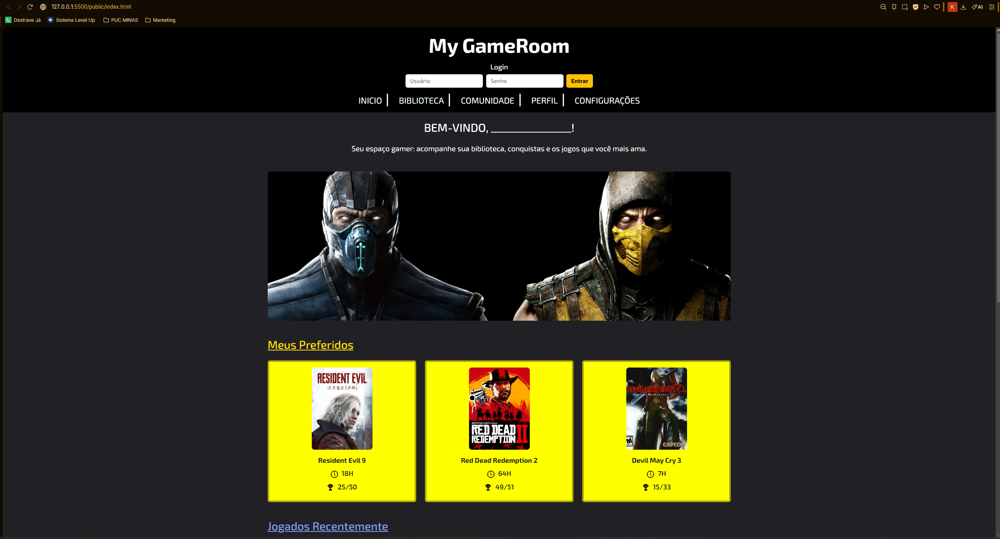
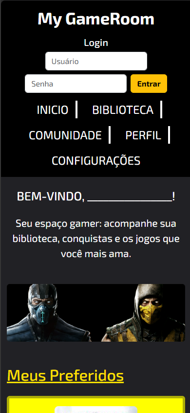

# Trabalho Prático - Semana 6

Nessa atividade, como sempre, vamos evoluir o que foi feito na semana anterior. Fique atento para fazer o projeto da semana anterior e dar sequência nessa jornada.

No trabalho dessa semana vamos alterar o projeto para que a responsividade da home-page seja feita, agora, com o framework Bootstrap.

**IMPORTANTE 1:** Você deve alterar apenas os arquivos **`README.md`**, **`index.html`** e **`styles.css`**, podendo incluir outros arquivos como imagens na pasta **`images`**, caso necessário. Deixe todos os demais arquivos e pastas desse repositório inalterados. **PRESTE MUITA ATENÇÃO NISSO.**

## Informações Gerais

Nome: Kaique Rodrigues do Vale
Matricula: 913328
Proposta de projeto escolhida: 4.Coleção e Itens = Biblioteca de Jogos
Breve descrição sobre seu projeto: Estou criando uma biblioteca de jogos em formato web, onde organizo os jogos em cards com imagem, título, horas jogadas e conquistas. O objetivo é ter um catálogo visual simples e interativo para facilitar a visualização e o controle dos jogos, evoluindo o projeto aos poucos com novas funcionalidades e melhorias de interface. Também pretendo adicionar um fórum de comunidade, onde os usuários poderão interagir, compartilhar opiniões e discutir sobre os jogos.

## Print da versão responsiva com Bootstrap [DESKTOP]

## Print da versão responsiva com Bootstrap [MOBILE]

(*) Utilize as ferramentas do desenvolvedor do seu navegador para colocar no modo reponsivo, escolha um celular qualquer e recarregue a página antes de tirar o print. 